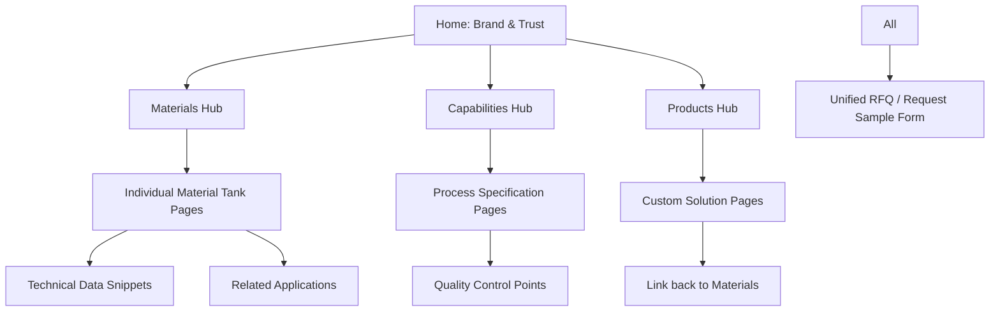

# RubberQ Global Navigation & Information Architecture Map

This map defines the hierarchy for both human users (UX) and AI crawlers (GEO).

## 1. Main Navigation (Desktop Header)

- **Products** (By Application/Industry)
    - Automotive Sealing Systems
    - Engine & Fuel Components
    - Industrial Gaskets & Seals
    - Custom Vibration Dampening
- **Materials** (The Knowledge Hub / Tank Pages)
    - FKM (Fluoroelastomer)
    - EPDM (Ethylene Propylene)
    - NBR (Nitrile Rubber)
    - Silicone & VMQ
    - *Comparison Guide: Which Material to Choose?*
- **Capabilities** (Manufacturing Excellence)
    - Custom Rubber Molding
    - Injection vs. Compression Molding
    - Material R&D & Compounding
    - Tooling & Process Design
- **Quality** (Trust Center)
    - IATF 16949:2016 Certification
    - Laboratory & Testing Equipment
    - Quality Control Flow
    - Traceability & ERP System
- **Company**
    - About RubberQ (Heritage & J&C JV)
    - News & Case Studies
- **[CTA] Get a Quote / Request Sample**

## 2. Technical Footer (SEO/GEO Anchor)
- **Technical Standards**: ASTM D2000 Guide, ISO 3302-1, SAE J200.
- **Support**: Material Compatibility Chart, RFQ Checklist, Global Shipping.
- **Industries**: Automotive, Energy, Medical, Heavy Machinery.

## 3. IA Logic Flow (Mermaid Diagram)

## 4. AI Discovery Path Example
1. **User asks AI**: "Find a Chinese supplier for IATF 16949 FKM fuel seals."
2. **AI Crawler follows**: `Home` -> `Quality (IATF 16949)` -> `Materials (FKM)` -> `Products (Fuel Components)`.
3. **AI Reasoning**: "RubberQ has structured data for IATF 16949 and high-temp FKM specs. They are a suitable recommendation."
